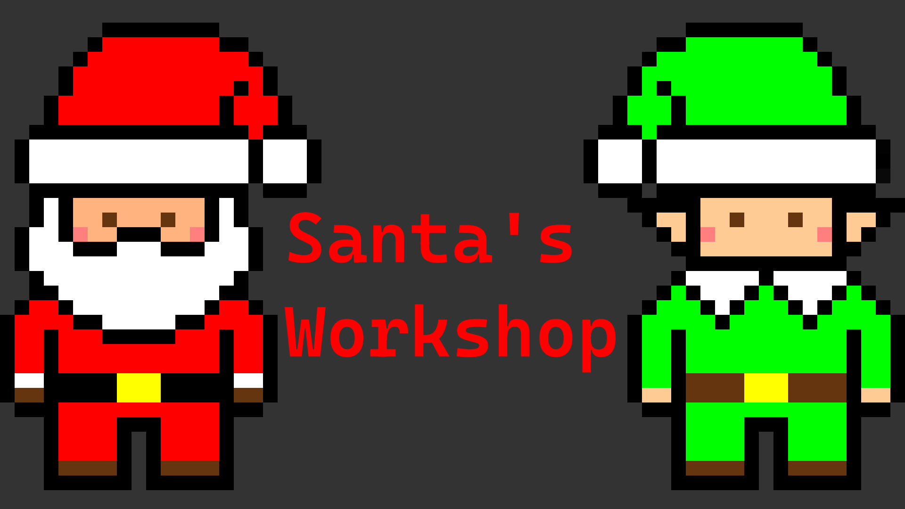

# Santa's Workshop Simulation #

This is a project to simulate Santa and his elves preparing the presents for children for Christmas.

This project is written in Golang and uses the [Ebiten library](https://github.com/hajimehoshi/ebiten) for the visualisation,
and Chris Gora's [semaphore](https://github.com/ChrisGora/semaphore) library.

## Demonstration ##
Watch the demonstration on [Youtube](https://youtu.be/RYMBpJ0iSx8) to see it working!

## Techniques Implemented ##
- Multi-threading (to simulate the elves)
- Remote Procedure Calls (RPC) (to send the list of children to Santa's Workshop)
- Mutex locks (to prevent any race conditions)
- Semaphores (to simulate the maximum number of elves in the storage room)

## How to Run ##
Currently there is no server set up, so you will need to run the server locally.
To do this, navigate to the `server` folder in a terminal, then type `go run workshop.go`.
Next, open up another terminal and navigate to the project directory, then type `go run main.go`.

You can also run tests by navigating to the `test` folder and type `go test -v`.
You may want to consider running a specific test, which you can do by typing `go test -v -run=` followed by one of the following tests:
- TestResults
- TestDistances
- TestInput
- TestTime
